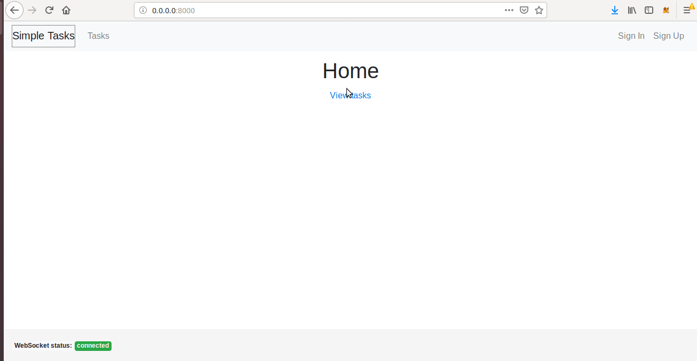

[](https://travis-ci.org/pplonski/simple-tasks)

# Simple-tasks



Simple tasks real-time updates with django channels, DRF, celery

This repo is showing example how you can use celery tasks and django channels to send tasks progress over the websockets. The client side is written in react and redux.

The task that is executed in celery it is simple add. It accepts two arguments in JSON format, example `{"arg1": 2, "arg2": 2}`. It will execute as long as the value of the `arg1`. If the value of `arg1` is negative the worker crash will be simulated in the code (crash with segfault). If the value of `arg2` is negative then the worker will crash during importing fake package. (Both crash simulations were used to show how we can set FAILURE state even if worker crashed).

In this example the task can be in following states: CREATED, PROGRESS, SUCCESS, FAILURE. The progress value is not stored in database, it is only broadcasted by websockets during task exceution.

The task states and progress are set by:
 - `backend/worker/redis_listener.py` which is pubsub on redis. It is updating the progress value.
 - `backend/worker/worker_listener.py` which is monitoring celery events. It is setting state values, for example in case of task failure.

#### Nginx configuration

In this example we are running `gunicorn` and `daphne` servers and redirecting requests in nginx:
 - HTTP is going to `gunicorn`
 - websocket is going to `daphne`

This can be changed, and both HTTP and websocket connectionscan be handled by `daphne` server.

#### Running

To run the app you can use docker-compose:

```
docker-compose up --build -d
```

To stop the app:

```
docker-compose down
```

The app will be accessed at `0.0.0.0:8000`.
